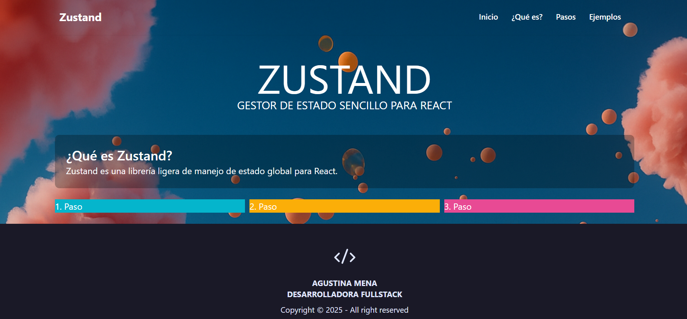

# Práctica con Zustand

Página web creada para practicar el uso de **Zustand** en React.  
Incluye:
- Definición de la librería  
- Pasos básicos de implementación  
- Ejemplos prácticos (contador, lista de tareas, dark mode)  

##  📸 Vista Previa

## Demo en vivo
[Ver Proyecto](https://zustand-practice-rouge.vercel.app/)
## Tecnologías
- React + Vite  
- Zustand  
- TailwindCSS  